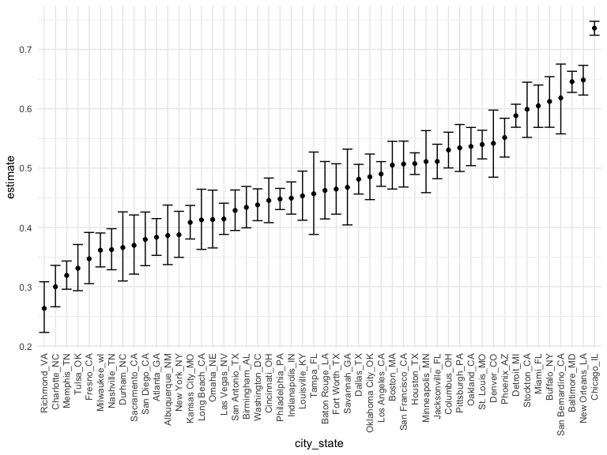

Homework 5
================
Shane
2020-11-17

# Problem 1

``` r
homicide_df = 
  read_csv("data/homicide-data.csv") %>% 
  mutate(
    city_state = str_c(city, state, sep = "_"),
    resolved = case_when(
      disposition == "Closed without arrest" ~ "unsolved",
      disposition == "Open/No arrest"        ~ "unsolved",
      disposition == "Closed by arrest"      ~ "solved",
    )
  ) %>% 
  select(city_state, resolved) %>% 
  filter(city_state != "Tulsa_AL")
```

    ## Parsed with column specification:
    ## cols(
    ##   uid = col_character(),
    ##   reported_date = col_double(),
    ##   victim_last = col_character(),
    ##   victim_first = col_character(),
    ##   victim_race = col_character(),
    ##   victim_age = col_character(),
    ##   victim_sex = col_character(),
    ##   city = col_character(),
    ##   state = col_character(),
    ##   lat = col_double(),
    ##   lon = col_double(),
    ##   disposition = col_character()
    ## )

``` r
homicide_sum = 
  homicide_df %>% 
  group_by(city_state) %>% 
  summarize(
    hom_total = n(),
    hom_unsolved = sum(resolved == "unsolved")
  )
```

    ## `summarise()` ungrouping output (override with `.groups` argument)

``` r
prop.test(
  homicide_sum %>% filter(city_state == "Baltimore_MD") %>% pull(hom_unsolved), 
  homicide_sum %>% filter(city_state == "Baltimore_MD") %>% pull(hom_total)
) %>% 
  broom::tidy() %>% 
  select(estimate, conf.low, conf.high) %>% 
  knitr::kable()
```

|  estimate |  conf.low | conf.high |
| --------: | --------: | --------: |
| 0.6455607 | 0.6275625 | 0.6631599 |

``` r
prop_test = function(x){
  
  test = prop.test(
    homicide_sum %>% filter(city_state == x) %>% pull(hom_unsolved), 
    homicide_sum %>% filter(city_state == x) %>% pull(hom_total)
  ) %>% 
  broom::tidy() %>% 
  select(estimate, conf.low, conf.high) 
  
}
```

``` r
city_prop_test = 
  map(.x = homicide_sum$city_state, .f = ~prop_test(.x)) %>% 
  bind_rows() %>% 
  mutate(city_state = homicide_sum$city_state) %>% 
  select(city_state, everything())
```

``` r
city_prop_test %>% 
  mutate(city_state = fct_reorder(city_state, estimate)) %>% 
  ggplot(aes(x = city_state, y = estimate)) +
  geom_point() + 
  geom_errorbar(aes(ymin = conf.low, ymax = conf.high)) + 
  theme(axis.text.x = element_text(angle = 90, vjust = 0.5, hjust = 1))
```


