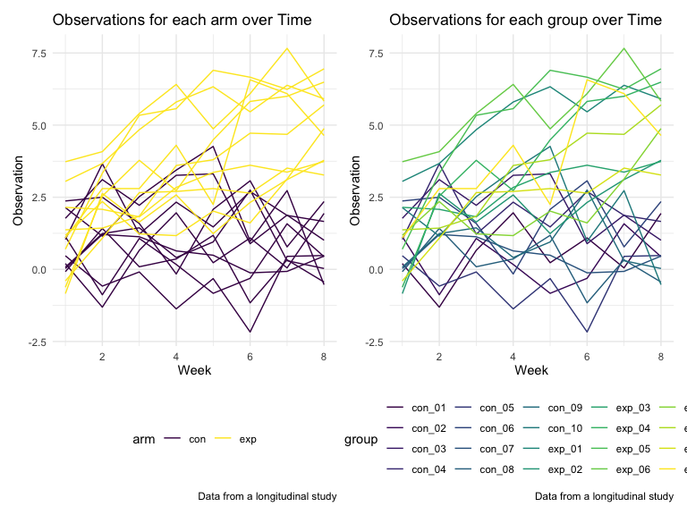

Homework 5
================
Shane
2020-11-18

``` r
set.seed(1)
```

# Problem 1

## import data

``` r
homicide_df = 
  read_csv("data/homicide-data.csv") %>% 
  mutate(
    city_state = str_c(city, state, sep = "_"),
    resolved = case_when(
      disposition == "Closed without arrest" ~ "unsolved",
      disposition == "Open/No arrest"        ~ "unsolved",
      disposition == "Closed by arrest"      ~ "solved",
    )
  ) %>% 
  select(city_state, resolved) %>% 
  filter(city_state != "Tulsa_AL")
```

    ## Parsed with column specification:
    ## cols(
    ##   uid = col_character(),
    ##   reported_date = col_double(),
    ##   victim_last = col_character(),
    ##   victim_first = col_character(),
    ##   victim_race = col_character(),
    ##   victim_age = col_character(),
    ##   victim_sex = col_character(),
    ##   city = col_character(),
    ##   state = col_character(),
    ##   lat = col_double(),
    ##   lon = col_double(),
    ##   disposition = col_character()
    ## )

## aggregate origin data

``` r
homicide_sum = 
  homicide_df %>% 
  group_by(city_state) %>% 
  summarize(
    hom_total = n(),
    hom_unsolved = sum(resolved == "unsolved")
  )
```

    ## `summarise()` ungrouping output (override with `.groups` argument)

## test on one data

``` r
prop.test(
  homicide_sum %>% filter(city_state == "Baltimore_MD") %>% pull(hom_unsolved), 
  homicide_sum %>% filter(city_state == "Baltimore_MD") %>% pull(hom_total)
) %>% 
  broom::tidy() %>% 
  select(estimate, conf.low, conf.high) %>% 
  knitr::kable()
```

|  estimate |  conf.low | conf.high |
| --------: | --------: | --------: |
| 0.6455607 | 0.6275625 | 0.6631599 |

## write function

``` r
prop_test = function(x){
  
  test = prop.test(
    homicide_sum %>% filter(city_state == x) %>% pull(hom_unsolved), 
    homicide_sum %>% filter(city_state == x) %>% pull(hom_total)
  ) %>% 
  broom::tidy() %>% 
  select(estimate, conf.low, conf.high) 
  
}
```

## function applied

``` r
city_prop_test = 
  map(.x = homicide_sum$city_state, .f = ~prop_test(.x)) %>% 
  bind_rows() %>% 
  mutate(city_state = homicide_sum$city_state) %>% 
  select(city_state, everything())
```

## making plot

``` r
city_prop_test %>% 
  mutate(city_state = fct_reorder(city_state, estimate)) %>% 
  ggplot(aes(x = city_state, y = estimate)) +
  geom_point() + 
  geom_errorbar(aes(ymin = conf.low, ymax = conf.high)) + 
  theme(axis.text.x = element_text(angle = 90, vjust = 0.5, hjust = 1))
```


# Problem 2

## get name

``` r
file_name = list.files("data/study_data")
```

## import data

``` r
data = 
  map(.x = str_c("data/study_data/", file_name),~read_csv(.x)) %>% 
  bind_rows() %>% 
  mutate(name = file_name) %>% 
  select(name, everything()) %>% 
  separate(name, c("arm", "arm_id", "end")) %>% 
  unite(group, c("arm", "arm_id"), remove = FALSE) %>% 
  select(!"end") %>% 
  pivot_longer(
    "week_1":"week_8", 
    names_to = "week", 
    values_to = "observation", 
    names_prefix = "week_"
  ) %>% 
  mutate(
    arm_id = as.numeric(arm_id),
    week = as.numeric(week)   
  )
```

    ## Parsed with column specification:
    ## cols(
    ##   week_1 = col_double(),
    ##   week_2 = col_double(),
    ##   week_3 = col_double(),
    ##   week_4 = col_double(),
    ##   week_5 = col_double(),
    ##   week_6 = col_double(),
    ##   week_7 = col_double(),
    ##   week_8 = col_double()
    ## )
    ## Parsed with column specification:
    ## cols(
    ##   week_1 = col_double(),
    ##   week_2 = col_double(),
    ##   week_3 = col_double(),
    ##   week_4 = col_double(),
    ##   week_5 = col_double(),
    ##   week_6 = col_double(),
    ##   week_7 = col_double(),
    ##   week_8 = col_double()
    ## )
    ## Parsed with column specification:
    ## cols(
    ##   week_1 = col_double(),
    ##   week_2 = col_double(),
    ##   week_3 = col_double(),
    ##   week_4 = col_double(),
    ##   week_5 = col_double(),
    ##   week_6 = col_double(),
    ##   week_7 = col_double(),
    ##   week_8 = col_double()
    ## )
    ## Parsed with column specification:
    ## cols(
    ##   week_1 = col_double(),
    ##   week_2 = col_double(),
    ##   week_3 = col_double(),
    ##   week_4 = col_double(),
    ##   week_5 = col_double(),
    ##   week_6 = col_double(),
    ##   week_7 = col_double(),
    ##   week_8 = col_double()
    ## )
    ## Parsed with column specification:
    ## cols(
    ##   week_1 = col_double(),
    ##   week_2 = col_double(),
    ##   week_3 = col_double(),
    ##   week_4 = col_double(),
    ##   week_5 = col_double(),
    ##   week_6 = col_double(),
    ##   week_7 = col_double(),
    ##   week_8 = col_double()
    ## )
    ## Parsed with column specification:
    ## cols(
    ##   week_1 = col_double(),
    ##   week_2 = col_double(),
    ##   week_3 = col_double(),
    ##   week_4 = col_double(),
    ##   week_5 = col_double(),
    ##   week_6 = col_double(),
    ##   week_7 = col_double(),
    ##   week_8 = col_double()
    ## )
    ## Parsed with column specification:
    ## cols(
    ##   week_1 = col_double(),
    ##   week_2 = col_double(),
    ##   week_3 = col_double(),
    ##   week_4 = col_double(),
    ##   week_5 = col_double(),
    ##   week_6 = col_double(),
    ##   week_7 = col_double(),
    ##   week_8 = col_double()
    ## )
    ## Parsed with column specification:
    ## cols(
    ##   week_1 = col_double(),
    ##   week_2 = col_double(),
    ##   week_3 = col_double(),
    ##   week_4 = col_double(),
    ##   week_5 = col_double(),
    ##   week_6 = col_double(),
    ##   week_7 = col_double(),
    ##   week_8 = col_double()
    ## )
    ## Parsed with column specification:
    ## cols(
    ##   week_1 = col_double(),
    ##   week_2 = col_double(),
    ##   week_3 = col_double(),
    ##   week_4 = col_double(),
    ##   week_5 = col_double(),
    ##   week_6 = col_double(),
    ##   week_7 = col_double(),
    ##   week_8 = col_double()
    ## )
    ## Parsed with column specification:
    ## cols(
    ##   week_1 = col_double(),
    ##   week_2 = col_double(),
    ##   week_3 = col_double(),
    ##   week_4 = col_double(),
    ##   week_5 = col_double(),
    ##   week_6 = col_double(),
    ##   week_7 = col_double(),
    ##   week_8 = col_double()
    ## )
    ## Parsed with column specification:
    ## cols(
    ##   week_1 = col_double(),
    ##   week_2 = col_double(),
    ##   week_3 = col_double(),
    ##   week_4 = col_double(),
    ##   week_5 = col_double(),
    ##   week_6 = col_double(),
    ##   week_7 = col_double(),
    ##   week_8 = col_double()
    ## )
    ## Parsed with column specification:
    ## cols(
    ##   week_1 = col_double(),
    ##   week_2 = col_double(),
    ##   week_3 = col_double(),
    ##   week_4 = col_double(),
    ##   week_5 = col_double(),
    ##   week_6 = col_double(),
    ##   week_7 = col_double(),
    ##   week_8 = col_double()
    ## )
    ## Parsed with column specification:
    ## cols(
    ##   week_1 = col_double(),
    ##   week_2 = col_double(),
    ##   week_3 = col_double(),
    ##   week_4 = col_double(),
    ##   week_5 = col_double(),
    ##   week_6 = col_double(),
    ##   week_7 = col_double(),
    ##   week_8 = col_double()
    ## )
    ## Parsed with column specification:
    ## cols(
    ##   week_1 = col_double(),
    ##   week_2 = col_double(),
    ##   week_3 = col_double(),
    ##   week_4 = col_double(),
    ##   week_5 = col_double(),
    ##   week_6 = col_double(),
    ##   week_7 = col_double(),
    ##   week_8 = col_double()
    ## )
    ## Parsed with column specification:
    ## cols(
    ##   week_1 = col_double(),
    ##   week_2 = col_double(),
    ##   week_3 = col_double(),
    ##   week_4 = col_double(),
    ##   week_5 = col_double(),
    ##   week_6 = col_double(),
    ##   week_7 = col_double(),
    ##   week_8 = col_double()
    ## )
    ## Parsed with column specification:
    ## cols(
    ##   week_1 = col_double(),
    ##   week_2 = col_double(),
    ##   week_3 = col_double(),
    ##   week_4 = col_double(),
    ##   week_5 = col_double(),
    ##   week_6 = col_double(),
    ##   week_7 = col_double(),
    ##   week_8 = col_double()
    ## )
    ## Parsed with column specification:
    ## cols(
    ##   week_1 = col_double(),
    ##   week_2 = col_double(),
    ##   week_3 = col_double(),
    ##   week_4 = col_double(),
    ##   week_5 = col_double(),
    ##   week_6 = col_double(),
    ##   week_7 = col_double(),
    ##   week_8 = col_double()
    ## )
    ## Parsed with column specification:
    ## cols(
    ##   week_1 = col_double(),
    ##   week_2 = col_double(),
    ##   week_3 = col_double(),
    ##   week_4 = col_double(),
    ##   week_5 = col_double(),
    ##   week_6 = col_double(),
    ##   week_7 = col_double(),
    ##   week_8 = col_double()
    ## )
    ## Parsed with column specification:
    ## cols(
    ##   week_1 = col_double(),
    ##   week_2 = col_double(),
    ##   week_3 = col_double(),
    ##   week_4 = col_double(),
    ##   week_5 = col_double(),
    ##   week_6 = col_double(),
    ##   week_7 = col_double(),
    ##   week_8 = col_double()
    ## )
    ## Parsed with column specification:
    ## cols(
    ##   week_1 = col_double(),
    ##   week_2 = col_double(),
    ##   week_3 = col_double(),
    ##   week_4 = col_double(),
    ##   week_5 = col_double(),
    ##   week_6 = col_double(),
    ##   week_7 = col_double(),
    ##   week_8 = col_double()
    ## )

## make plot

``` r
data %>% 
  ggplot(aes(x = week, y = observation, group = group, col = arm))+
  geom_line() +
  labs(
    title = "Observations for each arm over Time",
    x = "Week",
    y = "Observation",
    caption = "Data from a longitudinal study") +
  theme(legend.position = "bottom")
```



# Problem 3

## write function

``` r
sim_n_sd = function(n = 30, mu, sigma = 5) {
  
  sim_data = tibble(
    x = rnorm(n = n, mean = mu, sd = sigma),
  )
  
  sim_output = 
    sim_data %>% 
    t.test(mu = mu) %>% 
    broom::tidy() %>% 
    select(estimate, p.value)
  
  sim_output
}

sim_n_sd(mu = 0)
```

    ## # A tibble: 1 x 2
    ##   estimate p.value
    ##      <dbl>   <dbl>
    ## 1    0.412   0.629

## mu = 0 for 5000 times

``` r
output = vector("list", 5000)

for (i in 1:5000) {
  output[[i]] = sim_n_sd(mu = 0)
}

sim_results = bind_rows(output)
```
