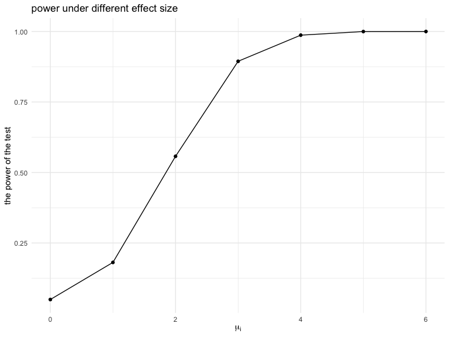

Homework 5
================
Shane
2020-11-19

# Problem 1

## import data

``` r
homicide_df = 
  read_csv("data/homicide-data.csv") %>% 
  mutate(
    city_state = str_c(city, state, sep = "_"),
    resolved = case_when(
      disposition == "Closed without arrest" ~ "unsolved",
      disposition == "Open/No arrest"        ~ "unsolved",
      disposition == "Closed by arrest"      ~ "solved",
    )
  ) %>% 
  select(city_state, resolved) %>% 
  filter(city_state != "Tulsa_AL")
```

    ## Parsed with column specification:
    ## cols(
    ##   uid = col_character(),
    ##   reported_date = col_double(),
    ##   victim_last = col_character(),
    ##   victim_first = col_character(),
    ##   victim_race = col_character(),
    ##   victim_age = col_character(),
    ##   victim_sex = col_character(),
    ##   city = col_character(),
    ##   state = col_character(),
    ##   lat = col_double(),
    ##   lon = col_double(),
    ##   disposition = col_character()
    ## )

## aggregate origin data

``` r
homicide_sum = 
  homicide_df %>% 
  group_by(city_state) %>% 
  summarize(
    hom_total = n(),
    hom_unsolved = sum(resolved == "unsolved")
  )
```

    ## `summarise()` ungrouping output (override with `.groups` argument)

## test on one data

``` r
prop.test(
  homicide_sum %>% filter(city_state == "Baltimore_MD") %>% pull(hom_unsolved), 
  homicide_sum %>% filter(city_state == "Baltimore_MD") %>% pull(hom_total)
) %>% 
  broom::tidy() %>% 
  select(estimate, conf.low, conf.high) %>% 
  knitr::kable()
```

|  estimate |  conf.low | conf.high |
| --------: | --------: | --------: |
| 0.6455607 | 0.6275625 | 0.6631599 |

## write function

``` r
prop_test = function(x){
  
  test = prop.test(
    homicide_sum %>% filter(city_state == x) %>% pull(hom_unsolved), 
    homicide_sum %>% filter(city_state == x) %>% pull(hom_total)
  ) %>% 
  broom::tidy() %>% 
  select(estimate, conf.low, conf.high) 
  
}
```

## function applied

``` r
city_prop_test = 
  map(.x = homicide_sum$city_state, .f = ~prop_test(.x)) %>% 
  bind_rows() %>% 
  mutate(city_state = homicide_sum$city_state) %>% 
  select(city_state, everything())
```

## making plot

``` r
city_prop_test %>% 
  mutate(city_state = fct_reorder(city_state, estimate)) %>% 
  ggplot(aes(x = city_state, y = estimate)) +
  geom_point() + 
  geom_errorbar(aes(ymin = conf.low, ymax = conf.high)) + 
  theme(axis.text.x = element_text(angle = 90, vjust = 0.5, hjust = 1))
```


# Problem 2

## get name

``` r
file_name = list.files("data/study_data")
```

## import data

``` r
data = 
  map(.x = str_c("data/study_data/", file_name),~read_csv(.x)) %>% 
  bind_rows() %>% 
  mutate(name = file_name) %>% 
  select(name, everything()) %>% 
  separate(name, c("arm", "arm_id", "end")) %>% 
  unite(group, c("arm", "arm_id"), remove = FALSE) %>% 
  select(!"end") %>% 
  pivot_longer(
    "week_1":"week_8", 
    names_to = "week", 
    values_to = "observation", 
    names_prefix = "week_"
  ) %>% 
  mutate(
    arm_id = as.numeric(arm_id),
    week = as.numeric(week)   
  )
```

    ## Parsed with column specification:
    ## cols(
    ##   week_1 = col_double(),
    ##   week_2 = col_double(),
    ##   week_3 = col_double(),
    ##   week_4 = col_double(),
    ##   week_5 = col_double(),
    ##   week_6 = col_double(),
    ##   week_7 = col_double(),
    ##   week_8 = col_double()
    ## )
    ## Parsed with column specification:
    ## cols(
    ##   week_1 = col_double(),
    ##   week_2 = col_double(),
    ##   week_3 = col_double(),
    ##   week_4 = col_double(),
    ##   week_5 = col_double(),
    ##   week_6 = col_double(),
    ##   week_7 = col_double(),
    ##   week_8 = col_double()
    ## )
    ## Parsed with column specification:
    ## cols(
    ##   week_1 = col_double(),
    ##   week_2 = col_double(),
    ##   week_3 = col_double(),
    ##   week_4 = col_double(),
    ##   week_5 = col_double(),
    ##   week_6 = col_double(),
    ##   week_7 = col_double(),
    ##   week_8 = col_double()
    ## )
    ## Parsed with column specification:
    ## cols(
    ##   week_1 = col_double(),
    ##   week_2 = col_double(),
    ##   week_3 = col_double(),
    ##   week_4 = col_double(),
    ##   week_5 = col_double(),
    ##   week_6 = col_double(),
    ##   week_7 = col_double(),
    ##   week_8 = col_double()
    ## )
    ## Parsed with column specification:
    ## cols(
    ##   week_1 = col_double(),
    ##   week_2 = col_double(),
    ##   week_3 = col_double(),
    ##   week_4 = col_double(),
    ##   week_5 = col_double(),
    ##   week_6 = col_double(),
    ##   week_7 = col_double(),
    ##   week_8 = col_double()
    ## )
    ## Parsed with column specification:
    ## cols(
    ##   week_1 = col_double(),
    ##   week_2 = col_double(),
    ##   week_3 = col_double(),
    ##   week_4 = col_double(),
    ##   week_5 = col_double(),
    ##   week_6 = col_double(),
    ##   week_7 = col_double(),
    ##   week_8 = col_double()
    ## )
    ## Parsed with column specification:
    ## cols(
    ##   week_1 = col_double(),
    ##   week_2 = col_double(),
    ##   week_3 = col_double(),
    ##   week_4 = col_double(),
    ##   week_5 = col_double(),
    ##   week_6 = col_double(),
    ##   week_7 = col_double(),
    ##   week_8 = col_double()
    ## )
    ## Parsed with column specification:
    ## cols(
    ##   week_1 = col_double(),
    ##   week_2 = col_double(),
    ##   week_3 = col_double(),
    ##   week_4 = col_double(),
    ##   week_5 = col_double(),
    ##   week_6 = col_double(),
    ##   week_7 = col_double(),
    ##   week_8 = col_double()
    ## )
    ## Parsed with column specification:
    ## cols(
    ##   week_1 = col_double(),
    ##   week_2 = col_double(),
    ##   week_3 = col_double(),
    ##   week_4 = col_double(),
    ##   week_5 = col_double(),
    ##   week_6 = col_double(),
    ##   week_7 = col_double(),
    ##   week_8 = col_double()
    ## )
    ## Parsed with column specification:
    ## cols(
    ##   week_1 = col_double(),
    ##   week_2 = col_double(),
    ##   week_3 = col_double(),
    ##   week_4 = col_double(),
    ##   week_5 = col_double(),
    ##   week_6 = col_double(),
    ##   week_7 = col_double(),
    ##   week_8 = col_double()
    ## )
    ## Parsed with column specification:
    ## cols(
    ##   week_1 = col_double(),
    ##   week_2 = col_double(),
    ##   week_3 = col_double(),
    ##   week_4 = col_double(),
    ##   week_5 = col_double(),
    ##   week_6 = col_double(),
    ##   week_7 = col_double(),
    ##   week_8 = col_double()
    ## )
    ## Parsed with column specification:
    ## cols(
    ##   week_1 = col_double(),
    ##   week_2 = col_double(),
    ##   week_3 = col_double(),
    ##   week_4 = col_double(),
    ##   week_5 = col_double(),
    ##   week_6 = col_double(),
    ##   week_7 = col_double(),
    ##   week_8 = col_double()
    ## )
    ## Parsed with column specification:
    ## cols(
    ##   week_1 = col_double(),
    ##   week_2 = col_double(),
    ##   week_3 = col_double(),
    ##   week_4 = col_double(),
    ##   week_5 = col_double(),
    ##   week_6 = col_double(),
    ##   week_7 = col_double(),
    ##   week_8 = col_double()
    ## )
    ## Parsed with column specification:
    ## cols(
    ##   week_1 = col_double(),
    ##   week_2 = col_double(),
    ##   week_3 = col_double(),
    ##   week_4 = col_double(),
    ##   week_5 = col_double(),
    ##   week_6 = col_double(),
    ##   week_7 = col_double(),
    ##   week_8 = col_double()
    ## )
    ## Parsed with column specification:
    ## cols(
    ##   week_1 = col_double(),
    ##   week_2 = col_double(),
    ##   week_3 = col_double(),
    ##   week_4 = col_double(),
    ##   week_5 = col_double(),
    ##   week_6 = col_double(),
    ##   week_7 = col_double(),
    ##   week_8 = col_double()
    ## )
    ## Parsed with column specification:
    ## cols(
    ##   week_1 = col_double(),
    ##   week_2 = col_double(),
    ##   week_3 = col_double(),
    ##   week_4 = col_double(),
    ##   week_5 = col_double(),
    ##   week_6 = col_double(),
    ##   week_7 = col_double(),
    ##   week_8 = col_double()
    ## )
    ## Parsed with column specification:
    ## cols(
    ##   week_1 = col_double(),
    ##   week_2 = col_double(),
    ##   week_3 = col_double(),
    ##   week_4 = col_double(),
    ##   week_5 = col_double(),
    ##   week_6 = col_double(),
    ##   week_7 = col_double(),
    ##   week_8 = col_double()
    ## )
    ## Parsed with column specification:
    ## cols(
    ##   week_1 = col_double(),
    ##   week_2 = col_double(),
    ##   week_3 = col_double(),
    ##   week_4 = col_double(),
    ##   week_5 = col_double(),
    ##   week_6 = col_double(),
    ##   week_7 = col_double(),
    ##   week_8 = col_double()
    ## )
    ## Parsed with column specification:
    ## cols(
    ##   week_1 = col_double(),
    ##   week_2 = col_double(),
    ##   week_3 = col_double(),
    ##   week_4 = col_double(),
    ##   week_5 = col_double(),
    ##   week_6 = col_double(),
    ##   week_7 = col_double(),
    ##   week_8 = col_double()
    ## )
    ## Parsed with column specification:
    ## cols(
    ##   week_1 = col_double(),
    ##   week_2 = col_double(),
    ##   week_3 = col_double(),
    ##   week_4 = col_double(),
    ##   week_5 = col_double(),
    ##   week_6 = col_double(),
    ##   week_7 = col_double(),
    ##   week_8 = col_double()
    ## )

## make plot

``` r
plot_arm = 
  data %>% 
  ggplot(aes(x = week, y = observation, group = group, col = arm))+
  geom_line() +
  labs(
    title = "Observations for each arm over Time",
    x = "Week",
    y = "Observation",
    caption = "Data from a longitudinal study") +
  theme(legend.position = "bottom")

plot_group = 
  data %>% 
  ggplot(aes(x = week, y = observation, group = group, col = group))+
  geom_line() +
  labs(
    title = "Observations for each group over Time",
    x = "Week",
    y = "Observation",
    caption = "Data from a longitudinal study") +
  theme(legend.position = "bottom")

plot_arm + plot_group
```


From the plot, it is obvious that experiment group has higher position
as whole, compared to control group. The difference is getting clear as
the study time being long. The differences also show up for each
individual con & exp groups.

# Problem 3

``` r
set.seed(1)
```

## write function

``` r
sim_n_sd = function(sample_size = 30, mu, sigma = 5) {
  
  sim_data = tibble(
    x = rnorm(n = sample_size, mean = mu, sd = sigma),
  )
  
  sim_output = 
    sim_data %>% 
    t.test(mu = 0, conf.level = 0.95) %>% 
    broom::tidy() %>% 
    select(estimate, p.value)
  
  sim_output
}
```

## mu = 0 for 5000 times

``` r
rerun(5000, sim_n_sd(mu = 0)) %>% 
  bind_rows()
```

    ## # A tibble: 5,000 x 2
    ##    estimate p.value
    ##       <dbl>   <dbl>
    ##  1    0.412  0.629 
    ##  2    0.664  0.368 
    ##  3    0.551  0.534 
    ##  4    0.567  0.487 
    ##  5   -1.65   0.0599
    ##  6    1.19   0.229 
    ##  7    0.334  0.738 
    ##  8   -1.19   0.209 
    ##  9    0.122  0.887 
    ## 10    0.684  0.472 
    ## # … with 4,990 more rows

## mu = 1:6

``` r
sim_results =
  tibble(mu = 0:6) %>% 
  mutate(
    output = map( .x = mu, ~rerun(5000,sim_n_sd(mu = .x ))),
    output = map(output, bind_rows)
  ) %>%
  unnest(output) 
```

## plot for power

``` r
sim_results %>% 
  mutate(reject = case_when(p.value < 0.05 ~ "reject", TRUE ~ "fail to reject")) %>% 
  group_by(mu) %>% 
  summarise(
    reject = sum(p.value < 0.05),
    count = n(),
    power = reject/count
  ) %>% 
  ggplot(aes(x = mu, y = power)) +
  geom_point() +
  geom_line() +
  labs(x = expression(mu[i]),
       title = "power under different effect size")
```

    ## `summarise()` ungrouping output (override with `.groups` argument)



Greater effect size is associated with higher power. When effect size
goes to certain level of large as 4, 5, or 6 in this case, power
basically stay in a straight line.
